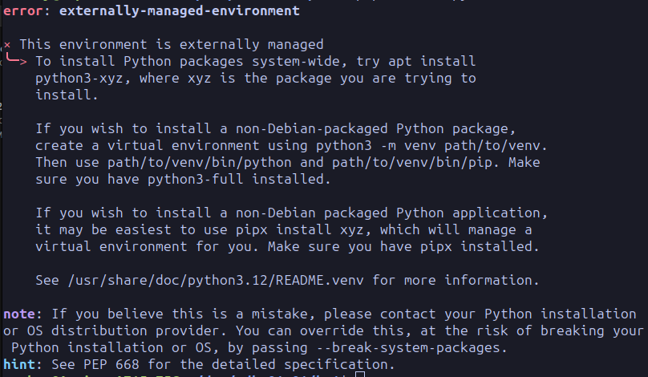

# 📘 Инструкция по разработке настольного приложения

## 🛠 1. Описание используемых инструментов

### 🐍 **Python**  
<p align="center">
  
</p>

> **Python** — высокоуровневый язык программирования, известный своей простотой и читаемостью. Мы используем его для реализации логики приложения.

---

### 🎨 **PySide6**  
<p align="center">
  
</p>

> **PySide6** — официальная оболочка для Qt6, позволяющая разрабатывать графические интерфейсы для настольных приложений.

---

### 🗄 **PostgreSQL**  
<p align="center">
  
</p>

> **PostgreSQL** — мощная система управления базами данных. Мы будем использовать её для хранения данных приложения.

---

### ✍ **VSCode**  
<p align="center">
  
</p>

> **Visual Studio Code** — бесплатный текстовый редактор с расширениями для Python и других языков.

---

## 🔧 2. Настройка VSCode

### 📌 Установка расширения Python

🐍 Для работы с python необходимо устаносить одноименное расширение в VScode.

<p align="center">
  
</p>

### 🚀 Установка PySide6

Для установки PySide6 в терминале необходимо ввести следущую команду:

```bash
pip install pyside6
```

❌ Если возникает ошибка при установке:
<p align="center">
  
</p>

✏️ Попробуйте создать виртуальное окружение:

```bash
python3 -m venv myvenv
source myvenv/bin/activate
pip install pyside6
```

🛑 По окончании работы, для выхода из виртуального окружения используйте:

```bash
deactivate
```

🔄 **Перезапустите VSCode**, чтобы подсказки для PySide6 начали работать!

---

## 📊 3. Работа с базой данных

### 📜 Отображение данных
```sql
-- Выбираем все записи из таблицы users
SELECT * FROM users;

-- Выбираем имя и email пользователей
SELECT name, email FROM users;

-- Фильтруем пользователей старше 18 лет
SELECT * FROM users WHERE age > 18;
```

### ➕ Добавление данных
```sql
-- Добавляем пользователя
INSERT INTO users (name, email, age)
VALUES ('Иван Иванов', 'ivan@example.com', 25);

-- Добавляем нескольких пользователей сразу
INSERT INTO users (name, email, age)
VALUES
  ('Петр Петров', 'petr@example.com', 30),
  ('Мария Смирнова', 'maria@example.com', 22);
```

### ❌ Удаление данных
```sql
-- Удаляем пользователя с id = 3
DELETE FROM users WHERE id = 3;

-- Удаляем всех пользователей младше 18 лет
DELETE FROM users WHERE age < 18;
```

### ✏ Редактирование данных
```sql
-- Обновляем email пользователя с id = 2
UPDATE users SET email = 'new_email@example.com' WHERE id = 2;

-- Увеличиваем возраст всех пользователей на 1 год
UPDATE users SET age = age + 1;
```

